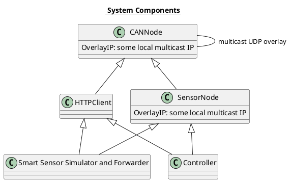
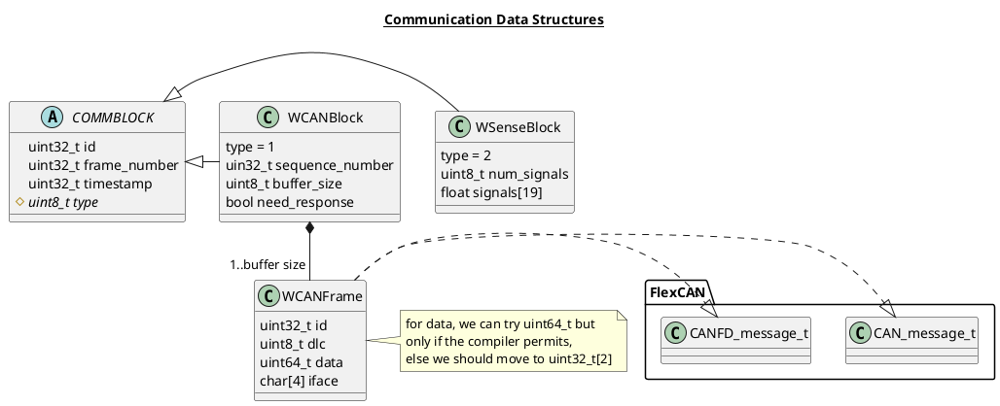
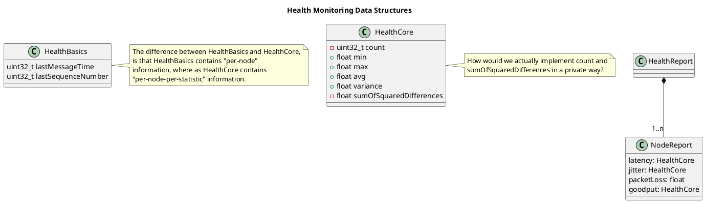
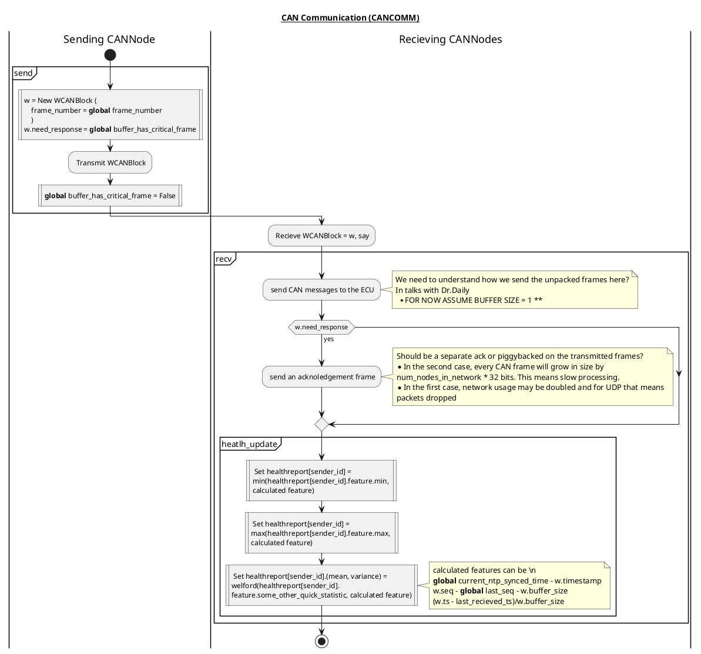
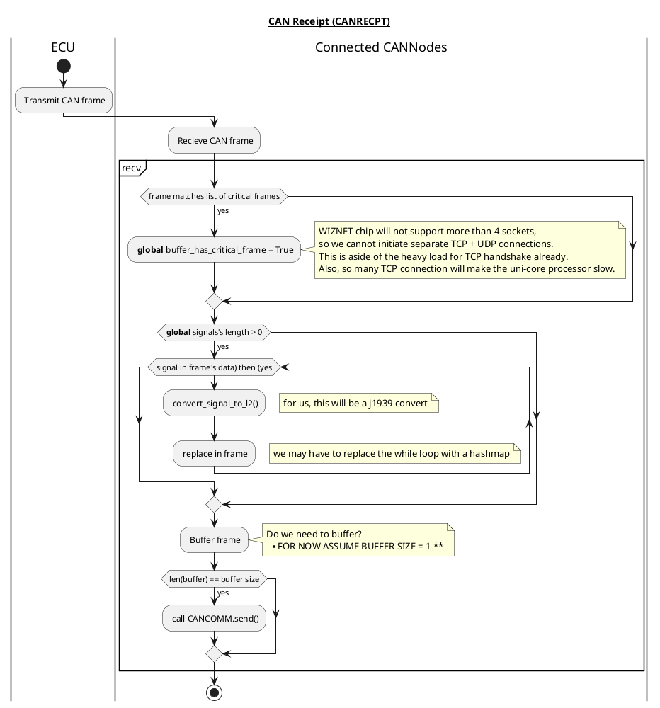
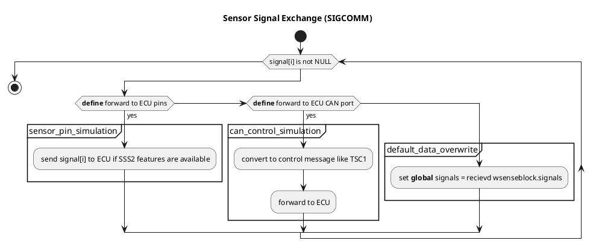
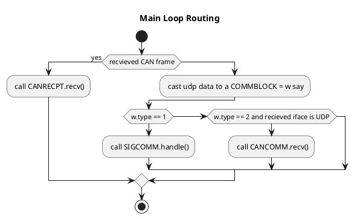

Software-defined X-in-the-loop Testbench for Controller Area Network Experiments
==============

# Features
* Long distance CAN overlays
  * Reconfigurable
* Real ECUs
* Optional reliability
* X-in-the-loop integration
  * Fidelity
* Heath monitoring for both X-ih-the-loop and CAN overlays

# Components and data structures

* SSSF Smart Sensor Simulator and Forwarder

# Behavior Models

# Future work
* Security