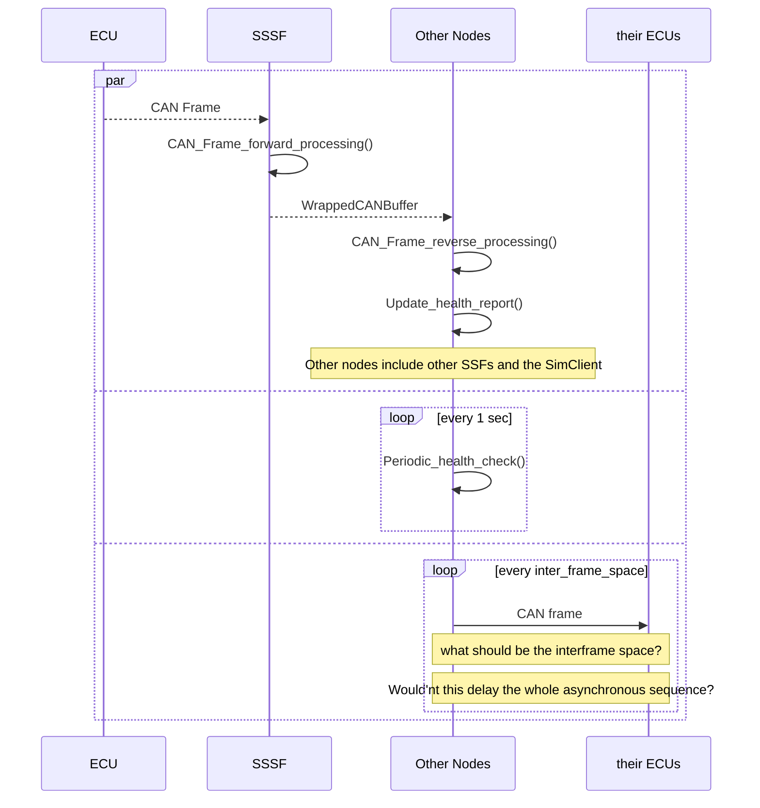
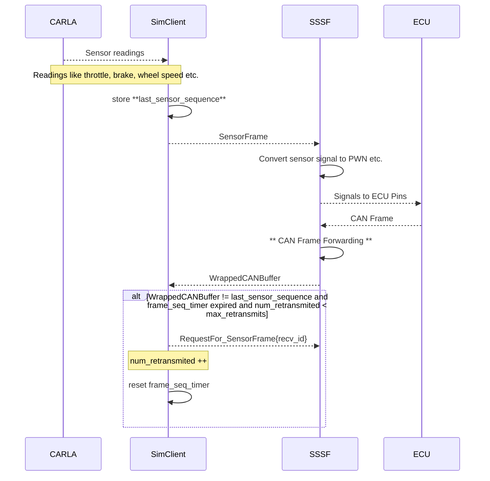
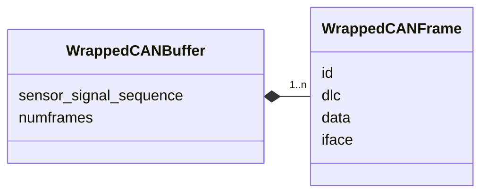
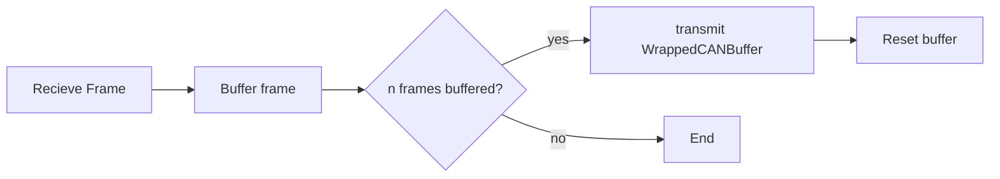
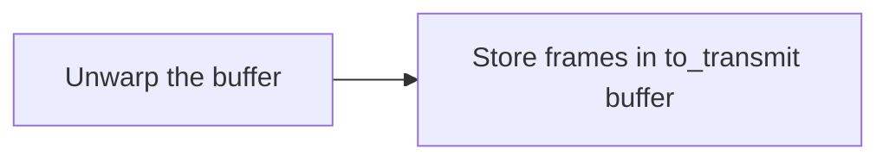
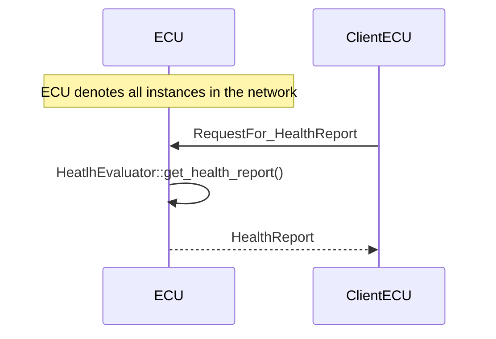
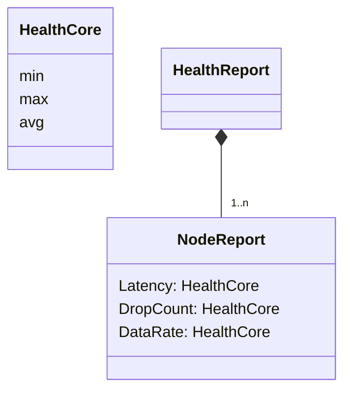

https://github.com/inasafe/inasafe/wiki/How-to-write-an-RFC

# RFC: Considerations for Tunneling Automotive Sensor Signals Over UDP

## Problem Statement
* Exposing CAN-based controllers can increase scalability of experimentation
* In-vehicle CAN-based controllers can communicate over faster, possibly reliable overlays, while ensuring backward compatibility
* Sensor signals can also communicated directly to the corresponding ECU pins
* This RFC describes some of the considerations for designing such an overlay

## Duration

## Current state
Draft

## Proposers
* Jeremy Daily
* Subhojeet Mukherjee
* Jacob Jepson

## Detail

## Solution Requirements
### Quality
* Reliability
* Low latency
* Fault tolerance
  
### Functional
* Integration of user knowledge in quality enhancement

## Proposal

### System Blocks

### Block Interactions

 CAN Frame Exchange 

* Periodic health check is required to ensure that even if the SSSF does not recieve a frame from some other node, the health reports are still updated every 1 sec

 Sensor Signal Forwarding 

* Here *frame_seq_timer* is calculated as $\frac{1}{max\_retransmits * frame rate}$ and *max_retransmits* and *frame_rate* are provided by the user

* **Future work** derive *num_frames* on-the-fly
  
### Internal Block Architectures
#### SSSF (Smart Sensor Simulator and Forwarder)

#### SimClient

### Block Methods
#### CAN Frame Forward Processing 

 CAN Frame Forward Processing 

* *n* above can be user defined or derived from network statistics
* Deriving *n* is kept for future?
* Do we even need this *n*? 
  * We need to experiment to see if the UDP frame rate is lower than CAN frame rate
  * Buffering CAN frames here and unwrapping them and transmitting them periodically at the reciever end can increase latency significantly
  * Alternatively, transmitting all the recieved frames at once may increase the load on ECU and on the SSSF. More importantly, this can cause frame rejection. For example, to prevent Request-overload request frames shall not be responded if they arrive faster than a rate. I think the J1939 standards have such restrictions for other transport PDUs too.
  
#### CAN Frame Reverse Processing 

 CAN Frame Reverse Processing 

#### Health Inspection

Health Inspection Process

Health Inspection Data Structures

## Record of Votes

## Resolution

## CC
